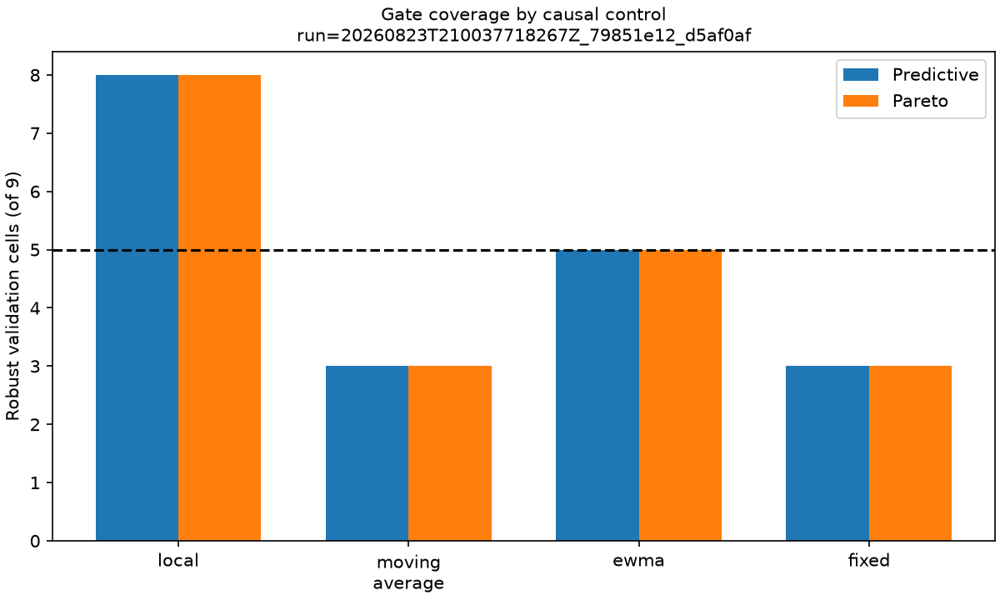
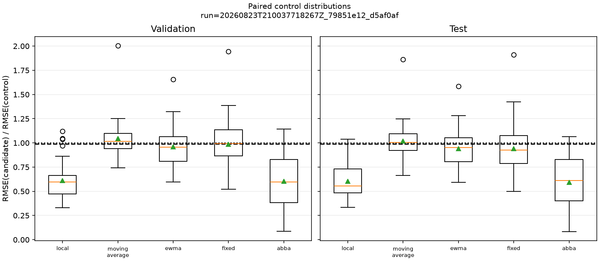
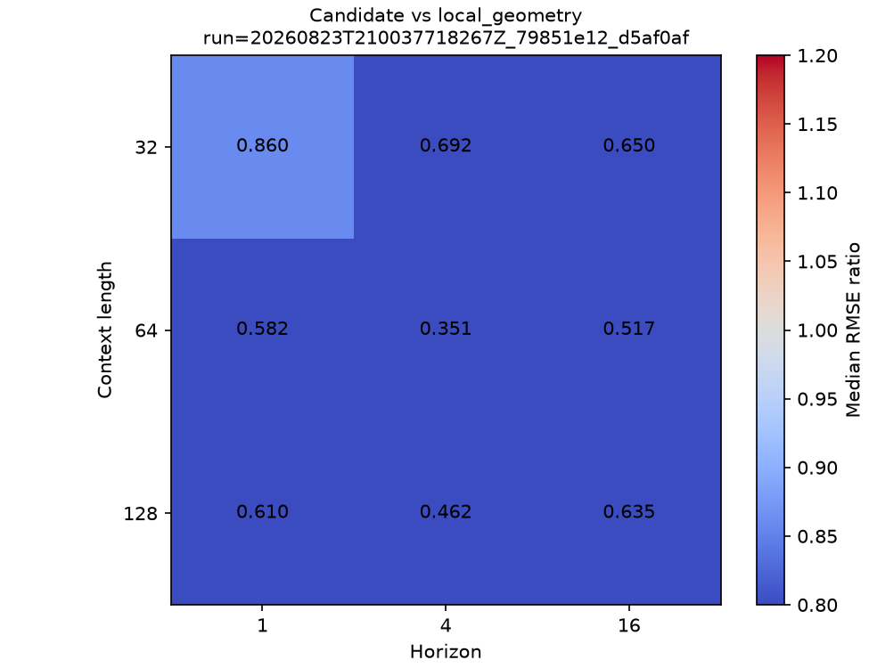
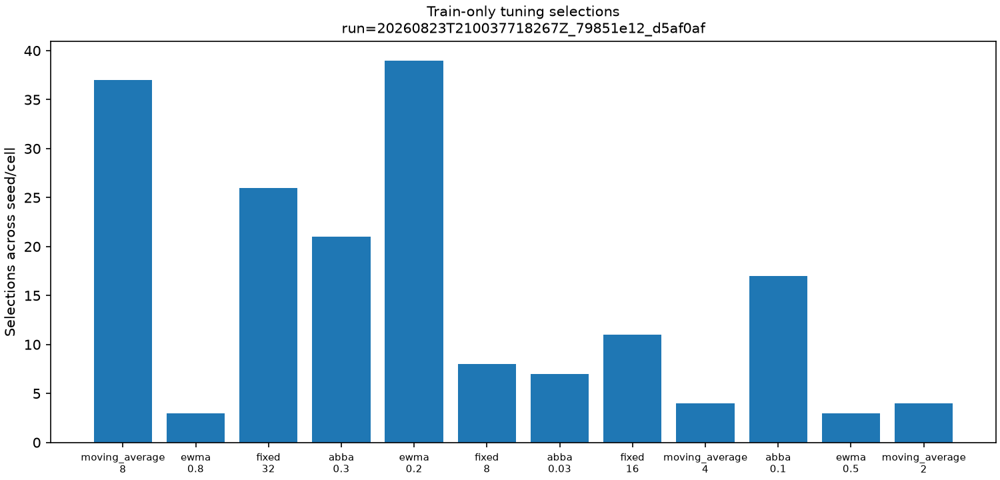

# Controles pareados da geometria absoluta

Status: **resultado de referência reproduzido; gate científico da Etapa 8 não satisfeito**.

Este experimento testa se o resultado exploratório de
`absolute_geometry = (dt, dy, theta, r)` resiste a explicações mais simples com o mesmo pooling,
ridge e capacidade downstream. O gate negativo é conclusivo para K3 nesta formulação: a candidata
superou geometria local e EWMA, mas não permaneceu robustamente superior à média móvel trailing e
à segmentação fixa.

## Identidade

- Run promovido: `20260823T210037718267Z_79851e12_d5af0af`.
- Reprodução computacional: `20260823T210528206430Z_79851e12_d5af0af`.
- Commit: `d5af0afe79924aedc0021177fa125b37b9c30e30`.
- Config combinada SHA-256:
  `79851e127fdd505f695c6def64ca547d47ecde5b141340793267295d7d62dafc`.
- Seeds: `1729`, `2718`, `31415`, `104729` e `8675309`; as seeds derivadas por sinal estão em
  `environment.json`.
- Ambiente: Windows 11, CPython 3.12.12, NumPy 2.5.2, Matplotlib 3.11.1 e fABBA 1.5.2.
- Estado Git nos dois runs: `dirty=false`.
- Avaliações externas: 360 em cada run; falhas: 0.
- Decisões de tuning: 540 em cada run.
- Duração total: 210,40 s no run promovido e 189,32 s na reprodução.

Comando de reprodução na raiz de um clone:

```powershell
uv sync --locked --dev --group abba
uv run --locked --group abba python experiments/07_forecasting_controls.py --config configs/forecasting/controls.toml
```

## Desenho congelado

A grade cruza cinco seeds, contextos `32/64/128` e horizontes `1/4/16`, com stride 4 e
`tolerance=0.1`. Os sete sinais, exemplos, alvos e splits são compartilhados. A validação externa
é o único split decisório; o teste é descritivo porque esse benchmark já foi observado.

| Representação | Construção | Escopo | Entradas pooled | Parâmetros |
|---|---|---|---:|---:|
| `absolute_geometry` | PLA adaptativa com `dt,dy,theta,r` | online estrito | 12 | 13 |
| `local_geometry` | geometria de cada incremento | online estrito | 12 | 13 |
| `moving_average_geometry` | média trailing + geometria local | online estrito | 12 | 13 |
| `ewma_geometry` | EWMA recursiva + geometria local | online estrito | 12 | 13 |
| `fixed_geometry` | segmentos de duração fixa | forecast-causal | 12 | 13 |
| `abba_geometry` | peças contínuas de `fABBA.compress` | offline na janela | 12 | 13 |

Os hiperparâmetros dos quatro controles ajustáveis foram escolhidos somente numa divisão bloqueada
80/20 dentro do treino externo. Cada família recebeu três candidatos; a candidata e o controle
local não receberam tuning. Esse orçamento favorece deliberadamente os controles e é conservador
para K3. A implementação usa apenas a compressão contínua do
[repositório oficial fABBA](https://github.com/nla-group/fABBA), não a representação simbólica
completa. A versão está congelada no grupo experimental como
[fABBA 1.5.2](https://pypi.org/project/fABBA/).

## Resultado do gate

O contraste é `RMSE(absolute_geometry) / RMSE(controle)`; valores menores que 1 favorecem a
candidata. Para cada controle causal, o gate exigia vantagem prática de 1% em 4/5 seeds, cinco de
nove células robustas e cinco de nove células Pareto robustas.

| Controle causal | Seeds, exigido 4/5 | Células preditivas, exigido 5/9 | Células Pareto, exigido 5/9 | Passou |
|---|---:|---:|---:|---|
| `local_geometry` | 5/5 | 8/9 | 8/9 | sim |
| `ewma_geometry` | 4/5 | 5/9 | 5/9 | sim |
| `fixed_geometry` | 4/5 | 3/9 | 3/9 | não |
| `moving_average_geometry` | 1/5 | 3/9 | 3/9 | não |

A grade de execução e a capacidade downstream passaram suas verificações, mas o gate científico
global falhou porque todos os controles causais precisavam passar.



## Efeito agregado

As razões abaixo são médias geométricas sobre as 45 combinações seed × célula. Elas são resumos
descritivos; as 45 linhas não são tratadas como réplicas independentes.

| Controle | Candidata/controle validação | Teste | Vitórias com margem validação | Teste |
|---|---:|---:|---:|---:|
| `local_geometry` | 0,584 | 0,581 | 42/45 | 44/45 |
| `ewma_geometry` | 0,941 | 0,921 | 29/45 | 29/45 |
| `fixed_geometry` | 0,953 | 0,909 | 22/45 | 27/45 |
| `moving_average_geometry` | 1,031 | 1,007 | 18/45 | 17/45 |
| `abba_geometry` | 0,515 | 0,513 | 41/45 | 43/45 |

Contra raw, `absolute_geometry` teve razão agregada de RMSE `0,71` em validação e `0,68` em
teste. A candidata usou em média 1,84 segmentos, 7,34 elementos escalares e 13 parâmetros. Esses
números preservam a observação anterior de um pipeline compacto e preditivo neste benchmark, mas
não identificam um mecanismo cinemático exclusivo.



## O que explica o resultado

A média móvel selecionou janela 8 em 37/45 células; janelas 2 e 4 foram escolhidas quatro vezes
cada. Ela foi superior principalmente em `sine`, `chirp` e `regime_change`. Em validação, as razões
candidata/controle agregadas por sinal foram aproximadamente `1,15`, `1,07` e `1,03`,
respectivamente. A candidata foi melhor em respostas de primeira e segunda ordem, rampa e sinal
piecewise-linear. Portanto, smoothing FIR simples explica o ganho agregado em parte das dinâmicas
e impede K3, sem explicar uniformemente todos os sinais.

A EWMA escolheu `alpha=0.2` em 39/45 células e perdeu para a candidata no gate. Assim, o resultado
não é explicado por qualquer suavizador causal arbitrário; depende da família e da dinâmica. A
segmentação fixa escolheu comprimento 32 em 26/45 células, 16 em 11 e 8 em oito. Embora a
candidata tenha vencido 4/5 seeds e a média agregada, a vantagem ocorreu em apenas 3/9 células
robustas, insuficiente para atribuir o efeito à adaptação das fronteiras.



## Controle ABBA descritivo

O controle `abba_geometry` selecionou tolerância `0.3` em 21/45 células, `0.1` em 17 e `0.03` em
sete. Produziu em média cerca de 1,22 peças e 4,87 elementos em validação, mas seu RMSE foi pior que
raw e aproximadamente o dobro do da candidata. Ele demonstra maior compactação estrutural, não
superioridade preditiva. Como peças anteriores podem mudar quando a janela cresce, permanece
rotulado `window_offline` e não entra no gate causal nem pode ser apresentado como equivalência
online.



## Verificação de reprodução

A segunda execução repetiu o gate negativo, 360/360 avaliações, 540/540 decisões de tuning, zero
falhas e `dirty=false`. `config.json`, `gate.json`, `conditions_by_signal.csv`, `tuning.csv`,
`summary_by_seed.csv` e `summary_by_signal.csv` foram idênticos byte a byte. Depois de excluir sete
colunas de timing, todas as 720 linhas de `conditions.csv` também foram idênticas; em `summary.csv`,
somente a mediana de runtime variou. Os 13 arquivos dos manifestos operacionais passaram verificação
independente de tamanho e SHA-256 nos dois runs.

Essa é reprodução computacional no mesmo commit e ambiente, não confirmação externa.

## Consequência para os claims

- K3 **não avança** nesta formulação: média móvel trailing e segmentação fixa bloqueiam o gate.
- K2 permanece rejeitada pela Etapa 7; este experimento não restaura evidência relacional.
- É permitido relatar que a geometria adaptativa absoluta superou controles locais e EWMA, com
  menor erro e payload no benchmark sintético pooled/ridge versionado.
- Não é permitido afirmar que adaptação, relações cinemáticas ou informação além de smoothing
  simples causaram o resultado.
- A Etapa 9 não deve ser aberta como confirmação de K2/K3. O próximo passo metodologicamente válido
  é revisar a hipótese ou estudar o estado autoregressivo como nova pergunta exploratória, sem
  herdar um claim de mecanismo que falhou.

## Limitações

- Sete sinais sintéticos, cinco seeds, uma intensidade de ruído, um pooling e um ridge.
- `tolerance=0.1` foi identificada na grade anterior e não é configuração confirmatória.
- Os controles ajustáveis receberam mais orçamento de tuning que a candidata.
- O controle ABBA avalia apenas peças contínuas, não quantização e forecasting simbólicos completos.
- Segmentação fixa é causal para a previsão, mas não replica o contrato de emissão online.
- Timings usam uma repetição e descrevem esta máquina/implementação.
- O alvo continua sendo um incremento raw, não o próximo vetor ou um rollout da cadeia.

## Arquivos promovidos

- `config.json`, `environment.json` e `gate.json`: desenho efetivo, ambiente, seeds e decisão.
- `conditions.csv` e `conditions_by_signal.csv`: resultados pareados sem arredondamento destrutivo.
- `tuning.csv`: todos os candidatos, erros internos e escolhas.
- `summary.csv`, `summary_by_seed.csv` e `summary_by_signal.csv`: agregações por célula, réplica e
  dinâmica.
- `plots/`: quatro figuras pré-especificadas.
- `reference-manifest.json`: tamanho Git e SHA-256 de cada arquivo promovido.
