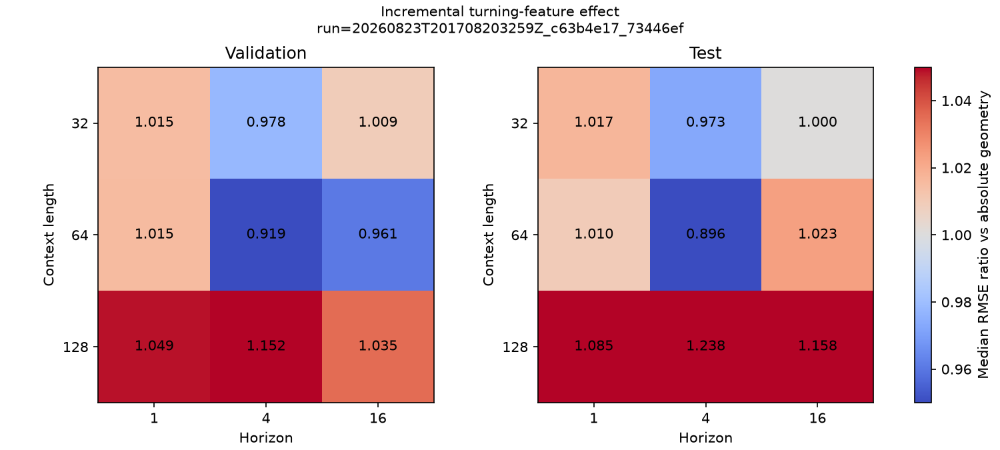
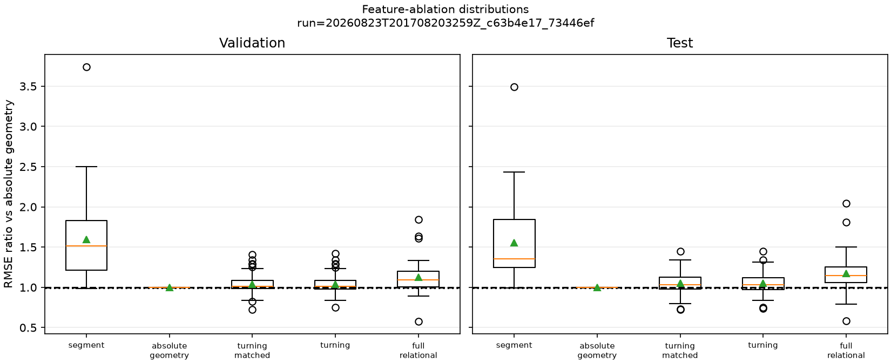
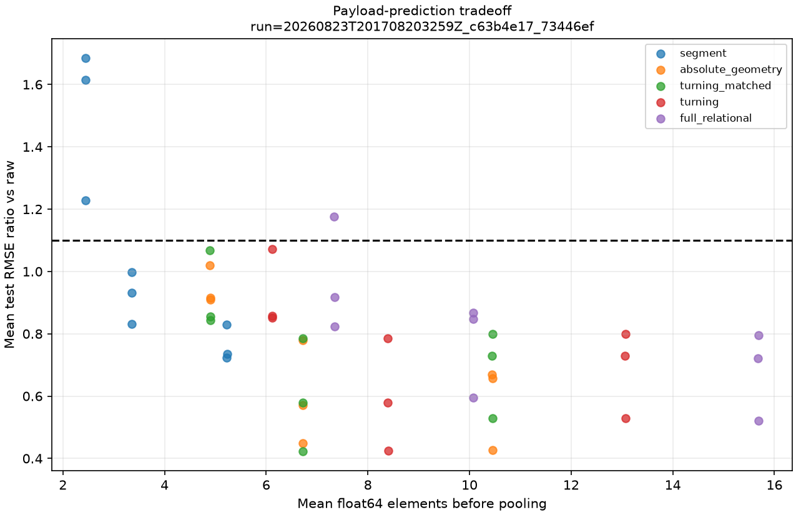
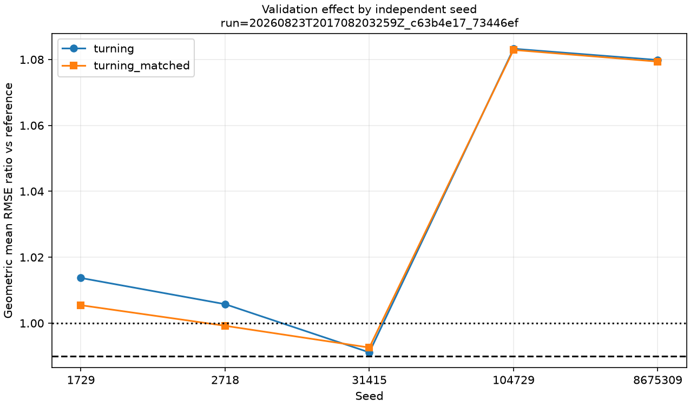

# Ablation cinemática do forecasting

Status: **resultado de referência revisado; gate científico da Etapa 7 não satisfeito**.

Este experimento testa se relações entre elos acrescentam efeito preditivo ao pacote de geometria
absoluta no benchmark sintético já observado. O resultado negativo é parte do programa científico:
ele encerra o avanço de K2 sob este pooling, ridge e conjunto de sinais, sem apagar o desempenho
anterior do pacote completo contra raw.

## Identidade

- Run promovido: `20260823T201708203259Z_c63b4e17_73446ef`.
- Run de réplica: `20260823T202400982158Z_c63b4e17_73446ef`.
- Commit: `73446eff021916ec9816a20ddea3ea393f147554`.
- Config combinada SHA-256:
  `c63b4e17bc3192948090f43db8acea129dbd9b7842e03f7cba73bc92fb3798fe`.
- Seeds: `1729`, `2718`, `31415`, `104729` e `8675309`; seeds derivadas por sinal estão em
  `environment.json`.
- Ambiente: Windows 11, CPython 3.12.12, NumPy 2.5.2 e Matplotlib 3.11.1.
- Estado Git nos dois runs: `dirty=false`.
- Avaliações: 315 em cada run; falhas: 0.
- Duração total: 370,52 s no run promovido e 376,23 s na réplica.

Comando de reprodução na raiz de um clone:

```powershell
uv sync --locked --all-extras --dev
uv run python experiments/06_forecasting_feature_ablation.py --config configs/forecasting/feature_ablation.toml
```

## Desenho congelado

A grade cruza cinco seeds, contextos `32/64/128` e horizontes `1/4/16`, com stride 4 e
`tolerance=0.1`. Essa tolerância veio da grade exploratória anterior e não é confirmatória. Todas as
variantes usam exatamente os mesmos sinais, exemplos, alvos, splits e fronteiras.

| Variante | Features | Entradas pooled | Parâmetros ridge | Papel |
|---|---|---:|---:|---|
| `segment` | `dt, dy` | 6 | 7 | cadeia adaptativa básica |
| `absolute_geometry` | `dt, dy, theta, r` | 12 | 13 | referência sem relações |
| `turning_matched` | `dt, dy, theta, delta_theta` | 12 | 13 | controle de capacidade |
| `turning` | `dt, dy, theta, r, delta_theta` | 15 | 16 | contraste primário |
| `full_relational` | anteriores + `delta_r` | 18 | 19 | análise secundária |

Validação é o único split decisório. Teste é descritivo, pois o benchmark já influenciou a escolha
de `tolerance=0.1`. A seed da realização conjunta dos sete sinais é a unidade de réplica; as nove
células dentro da seed são medidas repetidas.

## Resultado do gate

O contraste primário foi `RMSE(turning) / RMSE(absolute_geometry)`, com margem `<= 0.99`. O gate
exigia quatro de cinco seeds, cinco de nove células e não degradação do controle de capacidade em
quatro de cinco seeds.

| Verificação em validação | Exigido | Observado | Passou |
|---|---:|---:|---|
| Seeds primárias | 4/5 | 0/5 | não |
| Células primárias robustas | 5/9 | 1/9 | não |
| Seeds do controle de capacidade | 4/5 | 2/5 | não |
| Grade primária completa | completa | 315/315 avaliações, 0 falhas | sim |

As médias geométricas primárias por seed foram `1,0137`, `1,0058`, `0,9911`, `1,0833` e
`1,0799`. Mesmo a melhor seed não atingiu a margem de `0,99`. A única célula robusta foi contexto
64, horizonte 4, em validação: 4/5 seeds atingiram a margem, mas esse efeito isolado não autoriza
promoção retrospectiva. Nenhuma das nove células de teste foi robusta.



## O que as ablations mostraram

A tabela abaixo agrega descritivamente as 45 razões seed × célula de cada split por média
geométrica. `Vitórias` conta razões menores que 1; `margem` conta razões `<= 0.99`. As células não
são tratadas como 45 réplicas independentes.

| Variante | Validação vs referência | Vitórias/margem | Teste vs referência | Vitórias/margem |
|---|---:|---:|---:|---:|
| `segment` | 1,53 | 1/1 de 45 | 1,50 | 1/0 de 45 |
| `absolute_geometry` | 1,00 | referência | 1,00 | referência |
| `turning_matched` | 1,03 | 19/15 de 45 | 1,04 | 14/12 de 45 |
| `turning` | 1,03 | 19/15 de 45 | 1,04 | 13/12 de 45 |
| `full_relational` | 1,11 | 8/7 de 45 | 1,15 | 7/7 de 45 |

Adicionar `delta_theta` ao pacote absoluto não produziu efeito incremental consistente. Adicionar
também `delta_r` piorou todas as médias geométricas por seed nos dois splits. `turning` e
`turning_matched` ficaram quase indistinguíveis: nas 90 condições dos dois splits, a média
geométrica `RMSE(turning) / RMSE(turning_matched)` foi `1,00237`, com desvio absoluto médio de
`0,00372`. Assim, os três parâmetros e o payload adicionais de `r` sobre o controle pareado não
compraram melhora global.



## Geometria absoluta, raw e payload

O resultado útil foi mais estreito que a hipótese relacional. Contra raw, as médias geométricas de
RMSE foram:

| Variante | Validação/raw | Teste/raw | Sucesso conjunto validação | Teste | Elementos médios | Parâmetros |
|---|---:|---:|---:|---:|---:|---:|
| `segment` | 1,08 | 1,01 | 27/45 | 30/45 | 3,67–3,68 | 7 |
| `absolute_geometry` | 0,71 | 0,68 | 41/45 | 41/45 | 7,34–7,35 | 13 |
| `turning_matched` | 0,73 | 0,70 | 41/45 | 41/45 | 7,34–7,35 | 13 |
| `turning` | 0,73 | 0,70 | 40/45 | 41/45 | 9,18–9,19 | 16 |
| `full_relational` | 0,78 | 0,78 | 39/45 | 39/45 | 11,01–11,03 | 19 |

Todas as variantes tiveram em média 1,84 segmentos por janela. O pacote de geometria absoluta foi
mais parcimonioso e teve menor erro agregado que o default relacional. Isso sustenta somente que as
transformações não lineares `theta/r`, quando pooled, forneceram features úteis ao ridge além das
estatísticas pooled de `dt/dy` neste benchmark. Como `theta` e `r` são funções determinísticas de
`dt/dy`, não há “informação nova” em sentido informacional, nem esta ablation separa a contribuição
individual de `theta` e `r`.



## Heterogeneidade e interpretação pós-hoc

O efeito relacional não foi uniforme entre dinâmicas. Para `turning`, somente `sine` teve média
geométrica menor que a referência nos dois splits (`0,96` em validação e `0,97` em teste). Chirp e
mudança de regime pioraram; as demais ficaram próximas de 1 ou mudaram pouco. Essa decomposição é
descritiva e não cria um novo contraste primário.

A cadeia extremamente curta em `tolerance=0.1` — média de 1,84 elos por janela — oferece uma
explicação plausível para o resultado: após pooling, há poucas transições nas quais
`delta_theta/delta_r` possam se expressar. Isso é uma hipótese gerada depois do resultado, não uma
justificativa para redesenhar a Etapa 7 ou testar outra tolerância no mesmo gate.



## Verificação de reprodução

A réplica repetiu o gate negativo, 315/315 avaliações, zero falhas e `dirty=false`. Em cada run,
os 13 arquivos do manifesto operacional passaram verificação independente de tamanho e SHA-256.

Foram comparadas 630 linhas de condições, 4.410 linhas por sinal, 225 auditorias estruturais, 126
resumos por célula, 50 resumos por seed e 882 resumos por sinal. `gate.json`, as auditorias e os
resumos por seed/sinal foram idênticos byte a byte; todos os campos científicos de `conditions.csv`
e `summary.csv` também foram idênticos. Somente durações, timestamps, run id e figuras que exibem o
run id ficaram fora da igualdade exigida.

## Consequência para os claims

- K2 **não avança** sob este pooling/ridge/benchmark.
- C2 continua proibido: não afirmar que relações cinemáticas carregam informação preditiva
  incremental além da geometria individual.
- K1 recebe evidência exploratória para o pacote `theta/r`, mas ainda precisa de ablations
  individuais e controles contra engenharia de features/suavização.
- O próximo experimento justificável é um controle de K1/K3: comparar `absolute_geometry` com
  smoothing causal, PLA, downsampling e features locais raw sob capacidade e payload pareados.
- K4 e K5 não devem ser apresentados como continuação confirmatória de um mecanismo relacional que
  falhou neste gate.

## Limitações

- Cinco seeds dão resolução muito discreta ao limiar 4/5.
- Sete sinais sintéticos, uma intensidade de ruído, um pooling e um ridge.
- `tolerance=0.1` foi selecionada em análise anterior e produz cadeias muito curtas.
- `turning_matched` iguala dimensão, mas substitui `r`; não é equivalência semântica perfeita.
- As variantes agrupam `theta/r` e `delta_theta/delta_r`; não identificam efeitos individuais.
- O forecasting prevê incremento raw após pooling, não o próximo elo nem rollout autoregressivo.
- Timings têm uma repetição e descrevem esta máquina/implementação.

## Arquivos promovidos

- `config.json`, `environment.json` e `gate.json`: desenho efetivo, ambiente, seeds e decisão.
- `conditions.csv` e `conditions_by_signal.csv`: resultados pareados sem arredondamento destrutivo.
- `step_audit.csv`: 225 assinaturas por variante provando igualdade da quantidade de passos por
  exemplo; nenhuma divergência.
- `summary.csv`, `summary_by_seed.csv` e `summary_by_signal.csv`: agregações por célula, réplica e
  dinâmica.
- `plots/`: quatro figuras pré-especificadas.
- `reference-manifest.json`: tamanho Git e SHA-256 de cada arquivo promovido.
