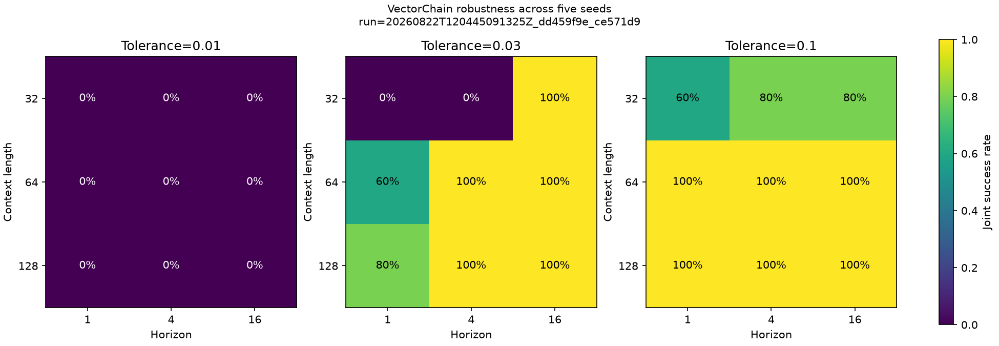
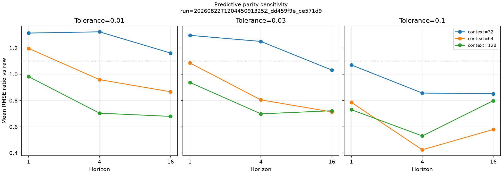
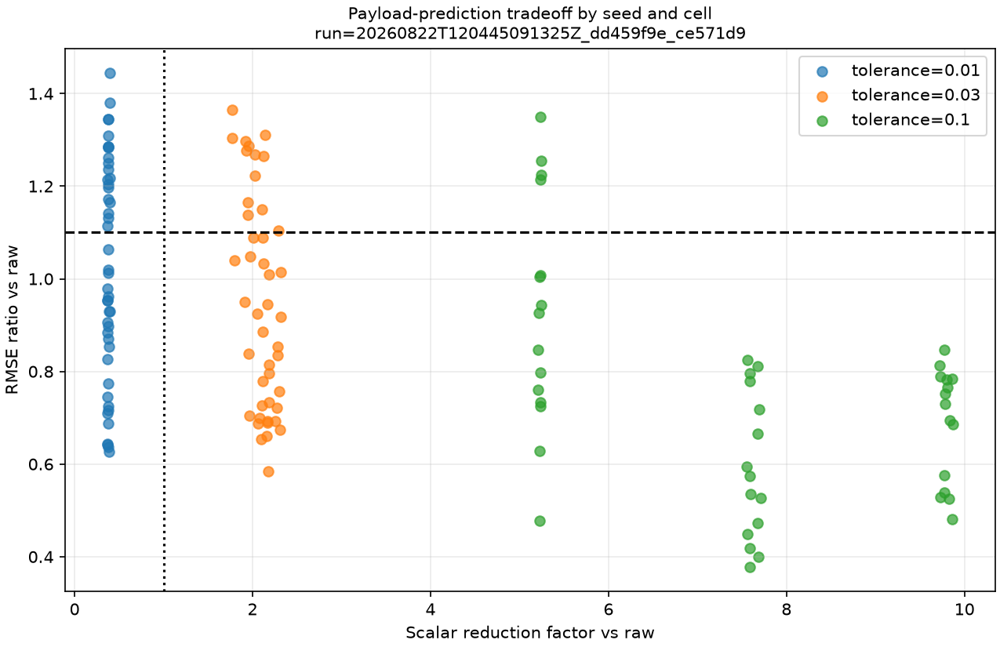

# Robustez do forecasting em grade fatorial

Status: **resultado de referência revisado do protocolo pré-especificado**.

Esta execução testa se o compromisso observado no forecasting mínimo persiste entre sementes,
horizontes, contextos e tolerâncias. A unidade de replicação é a seed da realização completa dos
sete sinais, não cada janela sobreposta. Uma célula é robusta somente quando o critério conjunto é
satisfeito em pelo menos quatro das cinco seeds.

## Identidade

- Run id promovido: `20260822T120445091325Z_dd459f9e_ce571d9`
- Run id de réplica: `20260822T121319215288Z_dd459f9e_ce571d9`
- Commit: `ce571d9f4d72006171e125dc0b5c063fccd74b17`
- Config combinada SHA-256:
  `dd459f9ea37962e4e1dfe29a9c810cd7a7a1ee87774ecb175a165739d6f224b3`
- Seeds: `1729`, `2718`, `31415`, `104729` e `8675309`; as 35 seeds derivadas por
  sinal estão em `environment.json`.
- Ambiente: Windows 11, CPython 3.12.12, NumPy 2.5.2 e Matplotlib 3.11.1.
- Estado Git nas duas execuções: `dirty=false`.
- Avaliações de representação: 225; falhas: 0.

Comando de reprodução, executado na raiz de um clone:

```powershell
uv sync --locked --all-extras --dev
uv run python experiments/05_forecasting_robustness.py --config configs/forecasting/robustness.toml
```

## Grade e critérios congelados

A grade cruza cinco seeds, contextos `32`, `64` e `128`, horizontes `1`, `4` e `16` e
tolerâncias VectorChain `0.01`, `0.03` e `0.1`, com stride 4. Raw e primeira diferença são
avaliados uma vez por seed/contexto/horizonte e reutilizados como pares; VectorChain é avaliado
nas 135 combinações completas. Cada condição produz linhas separadas de validação e teste.

O modelo, os sete sinais de 1.024 pontos, `noise_std=0.01`, o alvo de próximo incremento, o split
temporal, o pooling e o ridge (`alpha=0.001`) vêm sem alteração da baseline mínima. Os critérios
registrados antes da execução são:

- paridade preditiva: `RMSE(VectorChain) / RMSE(raw) <= 1.10`;
- redução estrutural: média de passos VectorChain `<= 0.5` da raw;
- redução de payload: média de elementos escalares VectorChain `<=` raw;
- sucesso conjunto: os três critérios anteriores na mesma seed e célula;
- célula robusta: sucesso conjunto em pelo menos `0.8`, isto é, quatro de cinco seeds.

## Resultado principal

No teste, **14 de 27 células** foram robustas. Na validação, foram **12 de 27**. Considerando as
135 condições seed × célula, o sucesso conjunto ocorreu em 73 no teste (54,07%) e em 69 na
validação (51,11%). Portanto, existe uma região robusta nesta grade, mas não robustez uniforme.

| Tolerância | RMSE/raw médio | RMSE/raw mediano | Passos médios | Redução de passos | Elementos médios | Redução escalar | Sucessos teste | Células robustas teste | Validação |
|---:|---:|---:|---:|---:|---:|---:|---:|---:|
| 0,01 | 1,0208 | 1,0125 | 39,55 | 1,89× | 197,73 | 0,38× | 0/45 | 0/9 | 0/9 |
| 0,03 | 0,9489 | 0,9253 | 6,99 | 10,48× | 34,95 | 2,10× | 32/45 | 6/9 | 5/9 |
| 0,1 | 0,7362 | 0,7329 | 1,84 | 37,75× | 9,19 | 7,55× | 41/45 | 8/9 | 7/9 |

Os fatores da tabela são médias das razões pareadas por seed e célula, não razões calculadas a
partir de médias globais. Um fator escalar abaixo de 1 significa aumento de payload: em `0.01`, os
cinco canais VectorChain tornam a representação maior que a entrada raw, apesar da pequena redução
em passos. Por isso nenhuma condição nessa tolerância satisfaz o critério conjunto.

Em `0.03`, o resultado é intermediário e dependente da célula. A combinação contexto 64,
horizonte 1 — próxima da baseline anterior, mas com stride 4 em vez de 2 — passa em apenas 3/5
seeds tanto no teste quanto na validação e, portanto, não é robusta. Em `0.1`, oito das nove células
de teste são robustas; a exceção é contexto 32, horizonte 1, com 3/5 seeds.



Contextos maiores e horizontes mais longos foram mais favoráveis nesta tarefa. Agregando as três
tolerâncias, a taxa conjunta de teste foi 35,56% em contexto 32, 62,22% em 64 e 64,44% em 128; por
horizonte, foi 44,44% em 1, 53,33% em 4 e 64,44% em 16. Isso descreve a grade observada e não
estabelece monotonicidade fora dela.



## Interpretação

A grade substitui a conclusão limítrofe de uma única seed por uma conclusão mais precisa. A
tolerância `0.03` preserva compressão e paridade em parte do domínio, mas não de forma uniforme. A
tolerância `0.1` apresenta o melhor compromisso observado nesta tarefa sintética e frequentemente
reduz também o erro, compatível com um efeito de suavização forte antes do ridge.

`0.1` não se torna uma nova configuração padrão por este relatório. Essa escolha foi identificada
após observar a própria grade de teste e precisa de confirmação em dados, ruídos e modelos não
usados nesta seleção. Também não se atribui a melhora ao mecanismo VectorChain sem controles de
suavização com capacidade equivalente.



## Verificação de reprodução

A réplica completa foi executada no mesmo commit e ambiente, novamente com 225/225 avaliações e
zero falhas. `config.json` foi idêntico byte a byte. Foram comparadas exatamente 450 linhas de
condições, 3.150 linhas por sinal, 90 linhas de resumo e 630 linhas de resumo por sinal: não houve
qualquer diferença em campos científicos. Somente colunas de duração, timestamps e figuras que
incorporam o run id ficaram fora da exigência de igualdade. Os dez arquivos de cada run também
passaram pela verificação independente de tamanho e SHA-256 de seus manifestos de execução.

## Limitações

- Cinco seeds tornam o limiar 4/5 discreto; não há intervalo de confiança confiável com esse n.
- Janelas sobrepostas não são réplicas independentes; inferência usa seed como unidade experimental.
- Somente sete sinais sintéticos, uma intensidade de ruído e 1.024 pontos por sinal.
- Tolerâncias, contextos e horizontes cobrem uma grade pequena e discreta.
- Um único pooling, conjunto de features e ridge; não há comparação com suavizadores pareados.
- Forecast rolling-origin usa observações reais anteriores, não previsões recursivas multi-step.
- A comparação por horizonte usa números diferentes de exemplos válidos e não mede latência online.
- Tempos usam uma repetição e descrevem esta implementação Python/máquina, não performance geral.
- A região `0.1` foi reconhecida nesta análise; confirmação futura deve congelá-la antes de novos testes.

## Arquivos promovidos

- `config.json` e `environment.json`: grade efetiva, configuração base, seeds, commit e ambiente.
- `conditions.csv`: 450 linhas de métricas globais por seed, representação e split.
- `conditions_by_signal.csv`: 3.150 linhas de métricas por dinâmica.
- `summary.csv` e `summary_by_signal.csv`: agregações entre seeds sem arredondamento destrutivo.
- `plots/`: quatro figuras globais pré-especificadas.
- `reference-manifest.json`: tamanho Git e SHA-256 de cada arquivo promovido.
