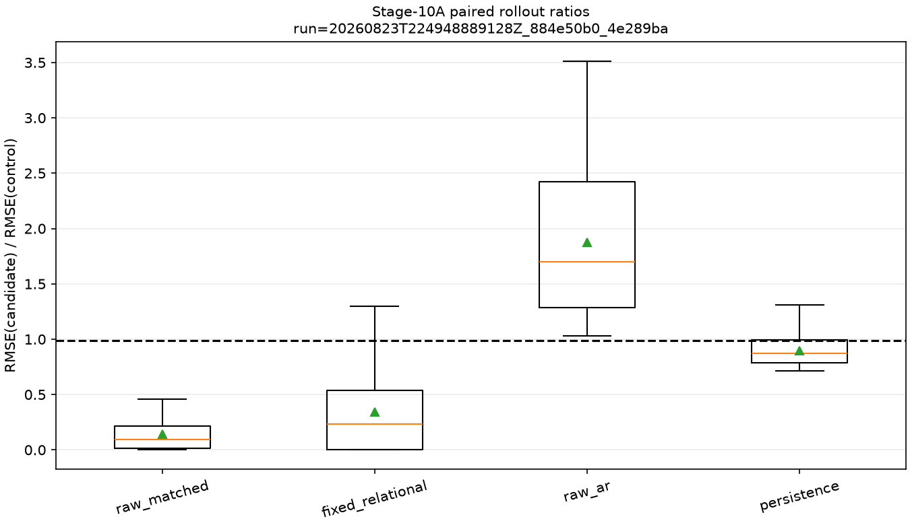
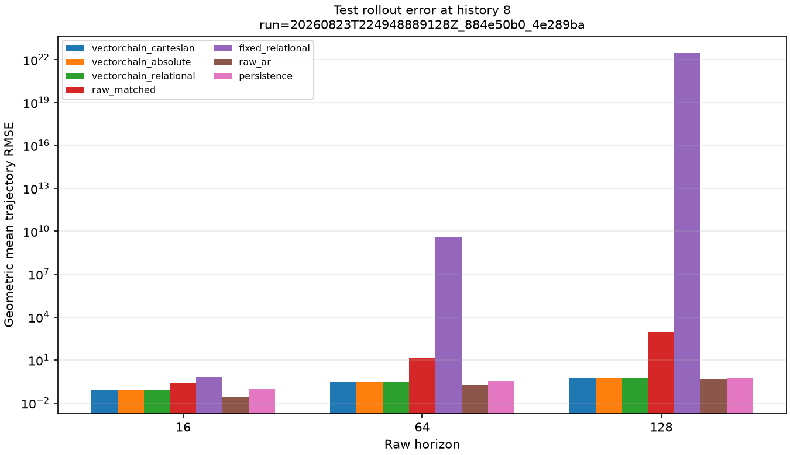
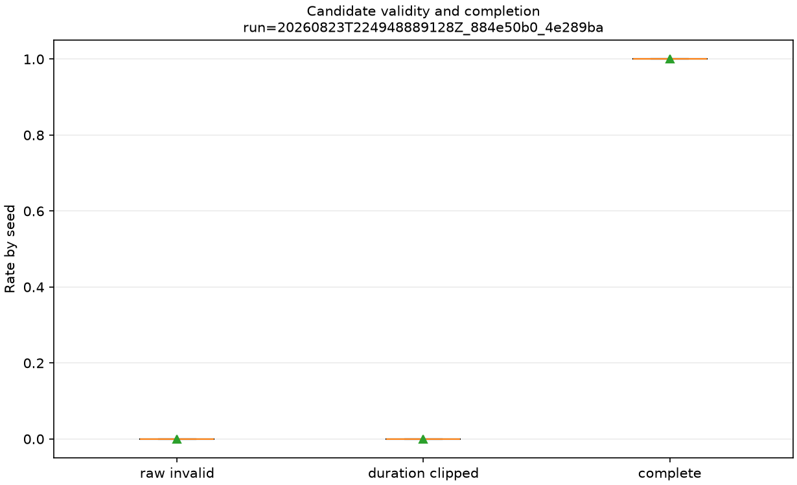
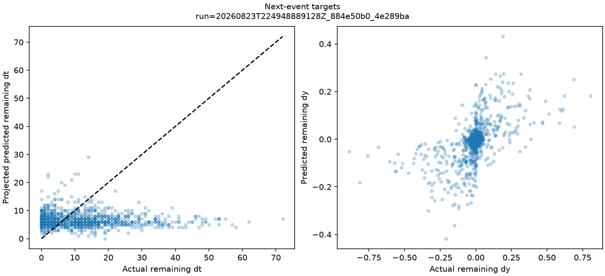

# Estado autoregressivo causal da cadeia

Status: **resultado de referência reproduzido; gate K5-A não satisfeito**.

Este é o primeiro experimento do projeto que usa a cadeia como sequência ordenada e reaplica a
mesma transição recursivamente. O resultado é informativo e negativo para o claim mais forte: o
estado VectorChain foi válido, estável e compacto, superou os controles de estado raw pareado,
segmentação fixa e persistência, mas perdeu para um AR raw simples em todas as cinco seeds e nos
três horizontes.

## Identidade

- Run promovido: `20260823T224948889128Z_884e50b0_4e289ba`.
- Reprodução computacional: `20260823T225242182768Z_884e50b0_4e289ba`.
- Commit: `4e289ba215c19c13f161aff94d084000b793789c`.
- Config combinada SHA-256:
  `884e50b06e1aaba2f0f00a436f7450faa42fc0e78038d39354b35a34a78cfa18`.
- Seeds experimentais: `5334086151564077557`, `9076691527785929283`,
  `1488991049205644303`, `2506524397075762905` e `228973438714350052`.
- Ambiente: Windows 11, CPython 3.12.12, NumPy 2.5.2 e Matplotlib 3.11.1.
- Estado Git nos dois runs: `dirty=false`.
- Condições agregadas: 630; falhas: 0.
- Duração: 91,97 s no run promovido e 89,83 s na reprodução.

Comando de reprodução:

```powershell
uv sync --locked --dev
uv run --locked python experiments/08_vector_state_rollout.py --config configs/forecasting/vector_state_rollout.toml
```

## Estado causal efetivamente testado

Um elo com endpoint `e` só é emitido ao observar `e+1`. A origem causal não foi deslocada
artificialmente para o endpoint. Cada estado foi:

```text
E_i = (segmento emitido S_i, primeiro incremento observado do elo aberto seguinte)
```

O modelo previu somente `remaining_dt`, `remaining_dy` e o próximo incremento aberto. Duração foi
projetada para inteiro não negativo; quando a duração restante projetada foi zero, o deslocamento
restante efetivo também foi zero. O rollout reconstruiu o trecho linear, acrescentou o próximo
incremento, formou `E_(i+1)` e repetiu a transição sem usar duração, endpoint ou fronteira futura
real.

Segmentos terminais produzidos apenas por `finalize()` foram excluídos. As 5.642 linhas de
`events.csv` satisfazem `emitted_at = end + 1`.

## Desenho pré-especificado

- sete sinais canônicos com 2.048 pontos e ruído `0.01`;
- cinco seeds novas, nunca usadas nos relatórios anteriores;
- `tolerance=0.03`, o default, porque `0.1` não fornece eventos suficientes em alguns sinais;
- splits temporais 60/20/20 determinados pela emissão do alvo;
- históricos `4/8/16`, com histórico 8 congelado como primário;
- horizontes raw comuns `16/64/128`;
- ridge `alpha=0.001`, sem tuning em validação/teste;
- teste como split decisório.

| Representação | Input no histórico 8 | Escalares | Parâmetros | Papel |
|---|---:|---:|---:|---|
| `vectorchain_cartesian` | 8 estados × 3 | 24 | 75 | ablation básica |
| `vectorchain_absolute` | 8 estados × 5 | 40 | 123 | ablation sem relações |
| `vectorchain_relational` | 8 estados × 7 | 56 | 171 | candidata |
| `raw_matched` | 56 diferenças raw | 56 | 171 | payload/capacidade pareados |
| `fixed_relational` | 8 estados × 7 | 56 | 171 | fronteiras fixas |
| `raw_ar` | 56 diferenças raw | 56 | 57 | AR recursivo simples |
| `persistence` | último valor | 1 | 0 | baseline sem treino |

A candidata cobriu em média 98,23 intervalos raw com oito passos; `raw_matched/raw_ar` cobriram 56
intervalos com 56 passos. Assim, houve redução de 7× nos passos com payload idêntico ao controle
pareado.

## Resultado do gate

O gate exigia, contra cada controle, razão
`RMSE(vectorchain_relational) / RMSE(controle) <= 0.99` em 4/5 seeds e 2/3 horizontes robustos.

| Controle | Seeds, exigido 4/5 | Horizontes, exigido 2/3 | Passou |
|---|---:|---:|---|
| `raw_matched` | 5/5 | 3/3 | sim |
| `fixed_relational` | 5/5 | 3/3 | sim |
| `persistence` | 4/5 | 2/3 | sim |
| `raw_ar` | 0/5 | 0/3 | **não** |

Todas as verificações de execução, validade após projeção, término, passos, escalares e parâmetros
passaram. Como todos os controles eram obrigatórios, K5-A falhou.



## O contraste decisivo: AR raw

As métricas abaixo são médias geométricas entre as cinco seeds no teste, histórico 8.

| Horizonte | RMSE VectorChain | RMSE AR raw | Razão candidata/AR |
|---:|---:|---:|---:|
| 16 | 0,0793 | 0,0286 | 2,77 |
| 64 | 0,2839 | 0,1781 | 1,59 |
| 128 | 0,5791 | 0,4812 | 1,20 |

O candidato perdeu para o AR raw em todas as famílias de sinal; as razões agregadas por dinâmica
variaram de aproximadamente 1,33 em `piecewise_linear` a 2,28 em `sine`. Por seed, a média
geométrica sobre os três horizontes ficou entre 1,53 e 1,97. Não há uma única seed ou dinâmica
isolada explicando a rejeição.

Histórico 4 reduziu a razão agregada para 1,38 e histórico 16 a piorou para 2,62. Essa sensibilidade
é descritiva: histórico 8 estava congelado e não pode ser substituído retrospectivamente. Mesmo a
melhor sensibilidade continuou pior que AR raw.



Esse gráfico foi re-renderizado em escala logarítmica durante a auditoria visual do relatório,
pois a explosão dos controles multioutput ocultava os demais modelos em escala linear. Nenhum
dado, resumo ou critério de decisão foi alterado.

## Estabilidade e controles pareados

O estado VectorChain completou 100% dos rollouts com 100% de estados válidos após projeção. No
próximo evento do teste, histórico 8, houve 1.151 previsões; MAE de duração restante foi 8,92,
RMSE de deslocamento restante 0,112 e RMSE do próximo incremento aberto 0,0258. Apenas uma previsão
projetou deslocamento restante para zero após duração zero; nenhuma duração bruta da candidata foi
negativa ou não finita.

Em contraste, os modelos multioutput `raw_matched` e `fixed_relational` tiveram durações brutas
inválidas em cerca de 40% dos rollouts e acumularam erros extremos, embora as projeções garantissem
término e validade estrutural. A candidata os superou amplamente, mostrando que seu estado é mais
estável para esta transição que um vetor raw de mesma dimensão. Isso não salva K5-A porque o AR raw
de um passo permaneceu simples, estável e mais preciso.



## Ablations do estado

Agregando seeds e horizontes no teste primário:

- `RMSE(relational) / RMSE(absolute) = 0,9999`: equivalência prática;
- `RMSE(relational) / RMSE(cartesian) = 1,0253`: o estado cartesiano foi cerca de 2,5% melhor,
  usando 24 em vez de 56 escalares e 75 em vez de 171 parâmetros.

Assim, a Etapa 10 novamente não encontrou contribuição útil de `theta/r/delta_theta/delta_r`
sobre a formulação cartesiana mais simples. O ganho observável foi estabilidade da cadeia causal,
não um mecanismo relacional.



## Verificação de reprodução

A reprodução repetiu o gate negativo, 630 condições, zero falhas e `dirty=false`.
`config.json`, `gate.json`, `events.csv`, `event_predictions.csv`, `summary.csv` e
`summary_by_seed.csv` foram idênticos byte a byte. Também houve zero diferenças científicas em 90
modelos, 64.890 rollouts, 630 condições e 4.410 condições por sinal depois de excluir apenas seus
campos de runtime. Os 15 arquivos de cada manifesto operacional passaram verificação independente
de tamanho e SHA-256.

Essa é reprodução computacional no mesmo commit e ambiente, não replicação externa.

## Consequência para os claims

- A hipótese central foi finalmente testada sem pooling e com rollout genuinamente recursivo.
- K5-A **não avança**: o estado VectorChain não foi competitivo com AR raw.
- Não é permitido afirmar que VectorChain funciona como espaço de estado autoregressivo útil nas
  condições avaliadas.
- É permitido relatar que a cadeia produziu rollouts válidos, compactos e mais estáveis que estados
  multioutput raw/fixos pareados, mas com maior erro que AR raw.
- A Etapa 10-B, ABBA-LSTM e modelos maiores não serão abertos pelo caminho pré-especificado, pois o
  gate linear básico falhou.

## Limitações

- Sete sinais sintéticos, uma intensidade de ruído e um ridge linear.
- O alvo de evento inclui duração, deslocamento restante e incremento aberto; outras distribuições
  ou losses poderiam tratar duração melhor, mas exigem nova hipótese.
- A projeção garante validade estrutural e pode ocultar instabilidade se a saída bruta não for
  reportada; por isso ambas foram preservadas.
- Segmentos verdadeiros aproximam curvas por cordas; o rollout prevê somente trajetórias lineares
  dentro de cada elo.
- O AR raw recebe mais alvos de treino e menos parâmetros, uma vantagem deliberadamente severa.
- O resultado não avalia datasets reais, timestamps irregulares nem modelos probabilísticos.

## Arquivos promovidos

- `config.json`, `environment.json` e `gate.json`: desenho, ambiente, seeds e decisão.
- `events.csv`: todos os 5.642 estados causais emitidos.
- `models.csv`: inputs, outputs, parâmetros, estado e treino das 90 condições de modelo.
- `conditions.csv` e `conditions_by_signal.csv`: métricas pareadas agregadas.
- `summary.csv` e `summary_by_seed.csv`: síntese por horizonte e unidade de réplica.
- `raw-tables.zip`: `event_predictions.csv` com 34.830 linhas e `rollouts.csv` com 64.890 linhas,
  preservados integralmente.
- `plots/`: quatro figuras pré-especificadas.
- `reference-manifest.json`: tamanho Git e SHA-256 de cada arquivo promovido.
