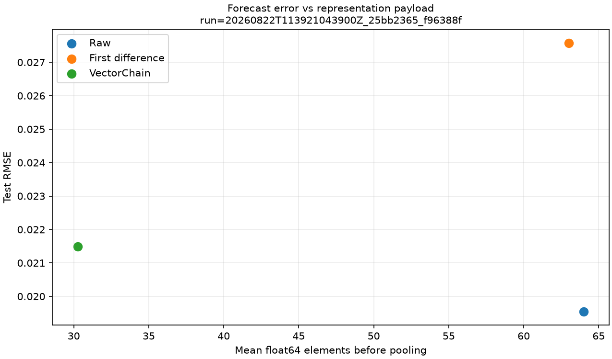

# Baseline de forecasting mínimo

Status: **resultado de referência revisado do protocolo pré-especificado**.

Esta execução compara raw, primeira diferença e VectorChain com o mesmo pooling, scaler de treino,
regressão ridge, alvo e split temporal. O critério conjunto foi satisfeito no teste por margem
mínima, mas não na validação; o resultado deve ser tratado como sinal para novas réplicas, não como
superioridade estabelecida.

## Identidade

- Run id promovido: `20260822T113921043900Z_25bb2365_f96388f`
- Run id de réplica: `20260822T114016397175Z_25bb2365_f96388f`
- Commit: `f96388ffcd2214f83c8a9d98fdacb86d5f42a023`
- Config SHA-256: `25bb2365dc96cd383d1d69bffe45064309672ceceacbe37846fc4b1a50b23690`
- Seed base: `31415`; as sete seeds derivadas estão em `environment.json`.
- Ambiente: Windows 11, CPython 3.12.12, NumPy 2.5.2 e Matplotlib 3.11.1.
- Estado Git nas duas execuções: `dirty=false`.
- Representações: 3; falhas: 0.

Comando de reprodução, executado na raiz de um clone:

```powershell
uv sync --locked --all-extras --dev
uv run python experiments/04_forecasting.py --config configs/forecasting/baseline.toml
```

## Condição experimental

Cada uma das sete dinâmicas possui 1.024 pontos e uma realização de ruído com `noise_std=0.01`.
Janelas de 64 pontos, horizonte 1 e stride 2 produziram 3.360 exemplos: 1.925 de treino, 721 de
validação e 714 de teste. O split usa o índice do alvo, com limites exclusivos 614 e 819.

O alvo comum é o próximo incremento. Cada sequência é resumida por último valor, média e desvio
padrão de cada feature. Scaler e ridge (`alpha=0.001`) são ajustados somente no treino agregado. A
tolerância VectorChain `0.03` foi transferida do benchmark de reconstrução; não houve tuning por
representação nem uso da validação para selecionar configuração.

## Resultados globais

| Representação | Test MAE | Test RMSE | RMSE/raw | Passos | Elementos float64 | Params. |
|---|---:|---:|---:|---:|---:|---:|
| raw | 0,015115 | **0,019544** | 1,000 | 64,00 | 64,00 | 4 |
| first difference | 0,019363 | 0,027573 | 1,411 | 63,00 | 63,00 | 4 |
| VectorChain | 0,015837 | 0,021495 | **1,0998** | **6,05** | **30,26** | 16 |
| persistência | 0,018049 | 0,023275 | 1,191 | — | — | 0 |

VectorChain teve RMSE 9,98% maior que raw e 7,65% menor que persistência. Pelo limiar registrado de
10%, a paridade preditiva no teste é `True`, com apenas cerca de 0,02 ponto percentual de margem.
Na validação, o RMSE ficou 13,47% acima de raw e a paridade foi `False`. Portanto, a passagem do
critério no teste não é robusta entre os dois blocos temporais.

A redução estrutural foi clara: 10,58× menos passos. Contando todas as cinco features, a redução de
payload ainda foi 2,12×, de 64 para 30,26 valores `float64` em média. Assim, os três critérios
pré-especificados são `True` no teste e o sucesso conjunto é registrado sem esconder sua margem.

O custo downstream aumentou. O pooling gerou 15 entradas e 16 parâmetros para VectorChain, contra
3 e 4 para raw. O estado do modelo ocupou 368 contra 80 bytes e o design matrix de treino 231.000
contra 46.200 bytes. A representação levou 3,51 s no total nesta máquina, contra 0,129 s para raw;
isso corresponde à implementação causal Python atual e não é conclusão geral de performance.



## Resultados por dinâmica

VectorChain teve RMSE menor que raw em rampa, piecewise linear e respostas de primeira e segunda
ordem. Ficou pior em seno, chirp e mudança de regime, sobretudo nas duas dinâmicas de frequência
mais rápida ou variável. Primeira diferença foi a melhor das três em quatro sinais localmente
suaves, mas degradou fortemente chirp e mudança de regime e terminou 41,08% pior que raw no agregado.

Esse padrão é compatível com uma troca entre suavização/redução e preservação de mudanças rápidas.
Ele não demonstra causalidade do mecanismo e precisa ser testado com mais seeds, horizontes e
escalas temporais.

## Hipóteses registradas

- F1: observada; os 3.360 IDs são idênticos nas três representações e não houve violação
  `target_index > origin`.
- F2: parcialmente observada por sinal, mas rejeitada no agregado; diferenças ficaram piores que raw
  e persistência.
- F3: observada; VectorChain reduziu passos e, mesmo com cinco features, também reduziu payload.
- F4: preservada; raw obteve o menor erro agregado, VectorChain o melhor compromisso payload/erro e
  diferenças apresentaram resultados positivos e negativos conforme a dinâmica.

## Verificação de reprodução

A réplica foi executada no mesmo commit e ambiente, também com 3/3 condições sem falhas. Os
arquivos `config.json`, `examples.csv`, `inputs.csv`, `metrics_by_signal.csv`, `models.npz`,
`naive_metrics.csv` e `predictions.csv` foram idênticos byte a byte. Todas as métricas não temporais
também coincidiram; somente runtimes, timestamps e figuras identificadas pelo run id variaram.

## Limitações

- Uma realização por sinal e apenas sete sinais sintéticos; sem intervalo de confiança.
- Um horizonte, contexto, stride, tolerância, pooling e alpha.
- O critério de 10% é operacional e o resultado ficou praticamente sobre a fronteira.
- O pooling remove ordem interna e pode limitar representações de maneiras diferentes.
- Janelas sobrepostas compartilham observações; os 714 erros não são amostras independentes.
- O regressor VectorChain possui quatro vezes mais parâmetros devido às cinco features.
- Forecast rolling-origin usa observações reais anteriores, não previsões recursivas multi-step.
- Tempos e bytes não incluem um runtime otimizado, serialização ou overhead de objetos Python.

## Arquivos promovidos

- `config.json` e `environment.json`: configuração efetiva, seeds, commit e ambiente.
- `examples.csv`: os 3.360 contextos, origens, alvos e splits compartilhados.
- `inputs.csv`: passos, features, elementos e bytes por representação e exemplo.
- `metrics.csv` e `metrics_by_signal.csv`: resultados agregados sem arredondamento destrutivo.
- `naive_metrics.csv`: referência de persistência global e por sinal.
- `predictions.csv`: todas as 4.305 previsões de validação e teste.
- `models.npz`: scaler e coeficientes dos três modelos.
- `timings.csv`: repetições individuais de treino e inferência.
- `plots/`: quatro figuras globais pré-especificadas.
- `reference-manifest.json`: tamanho e SHA-256 de cada arquivo promovido.
