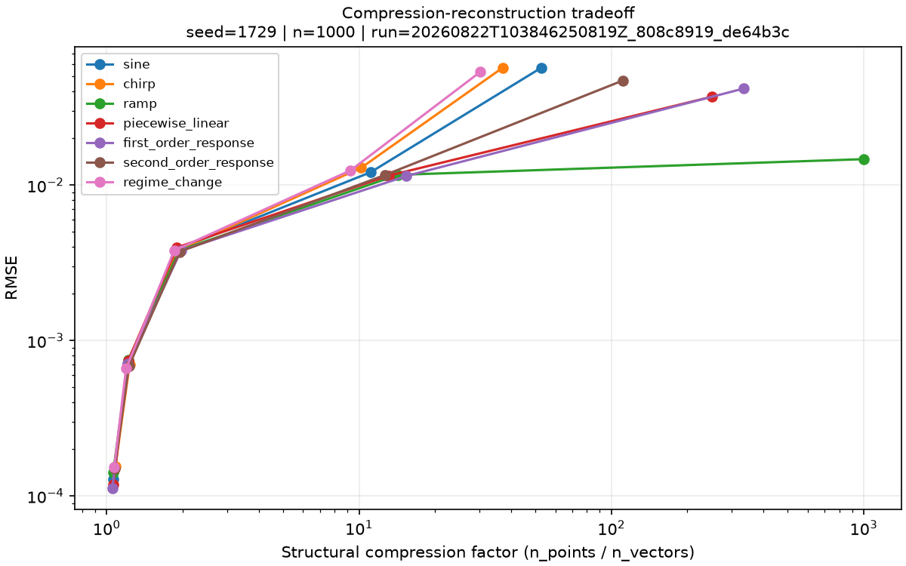

# Baseline de reconstrução e compressão

Status: **resultado de referência revisado do primeiro protocolo**.

Esta execução mede o compromisso entre redução estrutural da sequência e erro de reconstrução. Ela
não compara VectorChain com baselines externas e não sustenta alegação de superioridade geral.

## Identidade

- Run id: `20260822T103846250819Z_808c8919_de64b3c`
- Commit: `de64b3cedbff5ffdccebaed6225b6913383344ab`
- Config SHA-256: `808c8919f6107a674415e5e7a639700d69ed8bea7b1bc082cc9e3d3fa0218795`
- Seed base: `1729`; seeds derivadas por sinal estão em `environment.json`.
- Ambiente: Windows 11, CPython 3.12.12, NumPy 2.5.2 e Matplotlib 3.11.1.
- Estado Git durante a execução: `dirty=false`.
- Condições: 35; falhas: 0.

Comando de reprodução, executado na raiz de um clone:

```powershell
uv sync --locked --all-extras --dev
uv run python experiments/01_reconstruction.py --config configs/reconstruction/baseline.toml
```

## Condição experimental

Foram usados sete sinais de 1.000 pontos, ruído gaussiano nominal com `noise_std=0.01` e tolerâncias
absolutas `(0.001, 0.003, 0.01, 0.03, 0.1)`. Cada sinal foi gerado uma única vez. As cinco
repetições por condição medem somente runtime e não são tratadas como observações estatísticas
independentes.

## Resultados principais

O número de vetores caiu ou permaneceu igual e o RMSE subiu ou permaneceu igual a cada aumento de
tolerância, em todos os sete sinais. Portanto, H1 e H2 foram observadas integralmente nesta grade,
sem exceções não monotônicas.

| Sinal | Fator em 0,03 | RMSE em 0,03 | Fator em 0,1 | RMSE em 0,1 |
|---|---:|---:|---:|---:|
| sine | 11,111 | 0,012108 | 52,632 | 0,056820 |
| chirp | 10,204 | 0,012951 | 37,037 | 0,056901 |
| ramp | 14,286 | 0,011659 | 1000,000 | 0,014706 |
| piecewise linear | 13,158 | 0,011533 | 250,000 | 0,037065 |
| first-order response | 15,385 | 0,011450 | 333,333 | 0,041794 |
| second-order response | 12,658 | 0,011619 | 111,111 | 0,047153 |
| regime change | 9,259 | 0,012453 | 30,303 | 0,053717 |

`tolerance=0.03` produziu o compromisso mais uniforme desta grade: fatores entre 9,26 e 15,38 e
RMSE entre 0,01145 e 0,01295. Isso é uma observação da condição nominal, não um default universal.

Em `tolerance=0.01`, o fator ficou apenas entre 1,85 e 1,97, apesar do RMSE baixo. Esse é um
resultado negativo relevante: com tolerância próxima ao desvio do ruído, a representação preserva
muitos pontos e oferece pouca redução estrutural.

Em `tolerance=0.1`, a resposta depende fortemente da geometria. A rampa ruidosa virou um único
vetor com RMSE 0,01471, enquanto chirp e mudança de regime precisaram de 27 e 33 vetores e chegaram
a RMSE 0,05690 e 0,05372. Isso apoia qualitativamente H3 e mostra que uma única tolerância não tem
efeito uniforme entre dinâmicas. H4, porém, exige variação de amplitude/escala e não foi testada
nesta baseline nominal.

As medianas observadas variaram entre 0,0116 e 0,2344 segundos para transformação e entre 0,0000488
e 0,004823 segundos para reconstrução. Esses números pertencem à máquina registrada, não são
benchmark entre plataformas e a implementação ainda não foi otimizada.



## Limitações

- Uma realização de ruído por sinal; não há intervalo de confiança sobre MAE/RMSE.
- Tolerância absoluta e sinais em escala nominal comparável.
- Fator de compressão mede elementos da sequência, não bytes ou memória.
- Nenhuma comparação ainda com raw, diferenças ou segmentação fixa.
- A seleção visual de `0.03` é descritiva e não foi ajustada em conjunto de validação separado.
- Timings refletem Python/NumPy nesta máquina e não justificam conclusões de performance geral.

## Arquivos promovidos

- `config.json`: configuração integral e seeds resolvidas.
- `environment.json`: commit, estado Git, versões, plataforma e comando.
- `metrics.csv`: 35 linhas com métricas brutas e resumo de runtime.
- `timings.csv`: 350 medições individuais, separadas por fase.
- `plots/`: três curvas globais e três reconstruções representativas.
- `reference-manifest.json`: tamanho e SHA-256 de cada arquivo promovido.

Os 35 arquivos NPZ e as demais figuras permanecem no run local bruto em `artifacts/` e não são
versionados, conforme ADR 0002.
