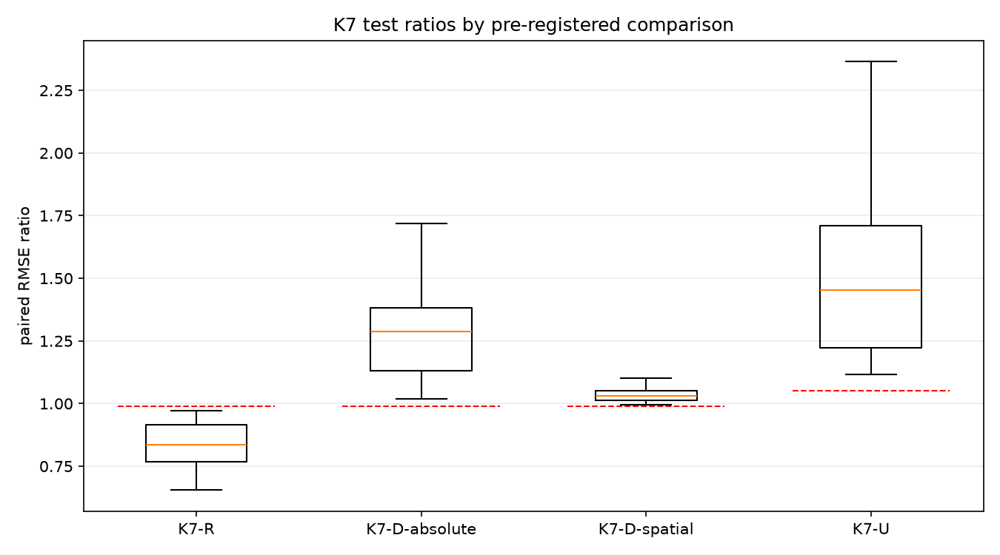
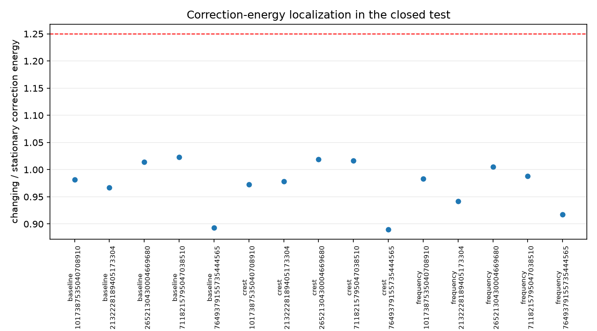
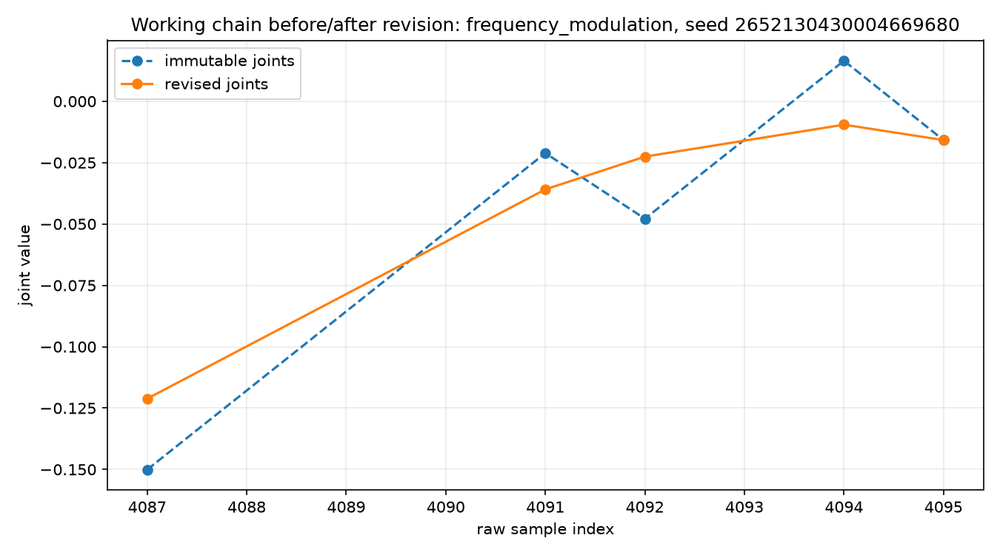

# K7 Stage 12-A — teste canônico da cauda revisável

Status: **resultado de referência reproduzido cientificamente; K7 completo não satisfeito**.

O teste fechado confirmou um resultado estreito e rejeitou o claim forte. Revisar causalmente a
geometria absoluta da cauda provisória melhorou de forma consistente a geometria imutável
(`K7-R`). Entretanto, as próprias atualizações temporais `update_theta/update_r` não acrescentaram
previsão sobre a geometria revisada nem sobre os deltas espaciais (`K7-D`), não localizaram as
regiões de mudança latente e ficaram muito atrás de raw pareado (`K7-U`). Como todos os subgates
eram obrigatórios, K7 falhou.

## Identidade e proveniência

- execução primária: `20260824T145539767422Z-b1482f2470`;
- commit científico primário limpo: `0bd82d533b24b19ee46597262f19be61072f3795`;
- reprodução computacional: `20260824T150319170256Z-b1482f2470`;
- commit corretivo limpo da reprodução: `0a3339beefffbc5f5899bdff6a8cd8ccff1c5a12`;
- SHA-256 da configuração de teste:
  `b1482f2470593254a07f5b72e0e4250662ef42f8382884c6c0f9430fbb780f54`;
- SHA-256 do lock de seleção:
  `d4e3e4ba8b03e4e8e3ca638cc2061790f84e81475a44cdc5713fb331525f58b2`;
- seleção herdada sem retuning: `lambda_revision=0.1`, `lambda_bend=1.0`;
- splits por endpoints: treino `[0,2048)`, validação não reutilizada no ajuste e teste
  `[2867,4096)`;
- 15 séries completas: três mecanismos × cinco seeds; horizontes `1/8/32`;
- ambiente: Windows 11, CPython 3.12.12, NumPy 2.5.2 e Matplotlib 3.11.1;
- duração: 125,72 s no primário e 123,73 s na reprodução; falhas científicas/de execução: zero.

O manifesto primário contém 30 arquivos, 55.927.376 bytes e SHA-256
`387d2d0860d3d575bbc22c7fb5fc356ddcfbfdae10e88e513ac6683586792a7`. O manifesto da reprodução
contém 31 arquivos, 55.931.365 bytes e SHA-256
`c49f2f07c1fb44dfaeae11634305f46f0ade6c693b19cea86f5de8efd1f87091`.

## Resultado decisório

Cada razão elementar usa o mesmo `mecanismo × seed × horizonte`; agregações usam média geométrica.
Intervalos são 10.000 bootstraps pareados das 15 séries completas e são apenas descritivos.

| Subgate | Razão global | Intervalo descritivo 95% | Seeds | Mecanismos | Horizontes | Resultado |
|---|---:|---:|---:|---:|---:|---|
| K7-R: revisável absoluta / imutável absoluta | 0,8297 | [0,8115; 0,8479] | 5/5 | 3/3 | 3/3 | **passou** |
| K7-D: temporal / revisável absoluta | 1,2688 | [1,2320; 1,3105] | 0/5 | 0/3 | 0/3 | não passou |
| K7-D: temporal / revisável espacial | 1,0375 | [1,0295; 1,0457] | 0/5 | 0/3 | 0/3 | não passou |
| K7-U: temporal / raw pareado | 1,4725 | [1,4239; 1,5358] | 0/5 | 0/3 | 0/3 | não passou |

K7-R não dependeu de uma única família: a razão foi `0,7946` para modulação de baseline, `0,8379`
para assimetria da crista e `0,8578` para modulação de frequência. Por horizonte, as médias
geométricas foram aproximadamente `0,92`, `0,74` e `0,83` para `H=1/8/32`, respectivamente, com
5/5 seeds aprovadas em cada um. A razão por seed variou de `0,7906` a `0,8502`.

O efeito também reproduziu o sinal não decisório da validação: `0,829554` na validação e
`0,829669` no teste. Isso sustenta um resultado condicional sobre **geometria revisada versus
imutável**, não sobre utilidade das features temporais.

## Energia de correção

A energia média em regiões `changing` dividida pela energia em `stationary` teve média geométrica
global `0,9718`, contra limiar pré-registrado `>=1,25`. O gate passou em 0/5 seeds, 0/3 mecanismos e
0/15 células `mecanismo × seed`. As agregações por mecanismo ficaram entre `0,9665` e `0,9747`.
Portanto, neste desenho, a magnitude das revisões não acompanhou seletivamente a mudança latente.

## Auditoria estrutural

As condições estruturais passaram integralmente:

- 61.440 versões auditadas e 245.472 estados de elo finitos;
- 23.670 elos comprometidos preservados como snapshots imutáveis;
- máximo de quatro elos e 33 intervalos raw observados na cauda, abaixo do limite 256;
- erro máximo dos dois anchors igual a zero;
- 15/15 auditorias de alteração arbitrária do sufixo;
- 15/15 auditorias de equivalência batch/stream, determinismo, alinhamento e payload;
- `dt` inteiro positivo, soluções e features finitas em 100% dos estados.

O estado integral de juntas, elos e eventos está comprimido no diretório operacional e coberto pelo
manifesto promovido.

## Reprodução e desvio operacional

A primeira tentativa de reprodução, `20260824T145823883808Z-b1482f2470`, foi corretamente
bloqueada antes da abertura (`test_opened=false`): a guarda comparava o JSON esperado em LF com o
arquivo gravado em CRLF no Windows. A falha, seu ambiente e seu manifesto foram preservados.

O fix posterior tornou a comparação de configuração semântica e não alterou sinal, modelo,
features, splits, agregações ou gate. Por isso a reprodução ocorreu no descendente corretivo
`0a3339b`, não literalmente no mesmo commit do primário. Esse desvio do protocolo é explícito:
`same_git_commit=false` e `guard_only_corrective_descendant=true` em `reproduction.json`.

Apesar do desvio operacional, 25/25 comparações científicas foram idênticas: configuração,
seleção, origens, previsões, auditorias, células, resumos e gate byte a byte; tabelas comprimidas
idênticas após descompressão; métricas idênticas excluindo somente runtime de treino; modelos
idênticos array a array. Não se trata de replicação externa independente.

## Claim permitido e claims rejeitados

O resultado máximo sustentado por esta etapa é:

> Nos três mecanismos sintéticos e cinco seeds pré-especificados, revisar causalmente as ordenadas
> das juntas provisórias melhorou a previsão baseada em geometria absoluta da cauda em relação à
> mesma geometria imutável, preservando quatro passos, payload e capacidade do modelo.

Esse enunciado é estreito, condicionado ao gerador sintético, ao solver, ao ridge e às fronteiras
fixas. Ele não estabelece novidade perante a literatura.

Não é permitido afirmar que:

- `update_theta/update_r` acrescentam sinal preditivo além da geometria revisada;
- as atualizações temporais implementam ou validam cinemática inversa útil;
- a candidata é não inferior a raw pareado — ela teve aproximadamente 47% mais RMSE agregado;
- K7 completo passou ou autoriza sinal combinado, fronteiras móveis, redes neurais ou dados reais
  por esta sequência.

A contribuição remanescente de K7 é o mecanismo causal auditável, o protocolo pareado e o achado
diagnóstico de que **revisar a geometria ajudou, mas usar a revisão como feature dinâmica não**.

## Arquivos promovidos

- `config.json`, `selection.json`, `primary-environment.json` e `gate.json`;
- `metrics.csv`, `comparison_cells.csv` e resumos por seed, mecanismo e horizonte;
- tabelas de energia e `bootstrap_summary.csv`;
- `causality_audit.csv`, `batch_stream_audit.csv` e `structural_summary.json`;
- `plots/`: três figuras derivadas das tabelas;
- `primary-source-artifact-manifest.json` e `reproduction-source-artifact-manifest.json`: hashes e
  tamanhos das tabelas integrais mantidas sob `artifacts/`;
- `reproduction.json`: comparação científica detalhada;
- três arquivos da tentativa bloqueada, preservando o desvio operacional;
- `reference-manifest.json`: hashes dos arquivos versionados desta referência.
