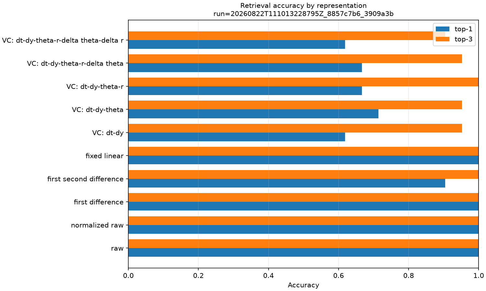

# Baseline de similaridade, ablations e retrieval

Status: **resultado de referência revisado do protocolo pré-especificado**.

Esta execução compara dez representações sob o mesmo split e o mesmo protocolo DTW. O resultado
não sustenta superioridade do VectorChain: nesta condição sintética, baselines simples foram
claramente mais fortes no top-1.

## Identidade

- Run id promovido: `20260822T111013228795Z_8857c7b6_3909a3b`
- Run id de réplica: `20260822T111207406511Z_8857c7b6_3909a3b`
- Commit: `3909a3bb721982c8ff8c5ddd70859bf7c99e42fb`
- Config SHA-256: `8857c7b6e9d0e9d7d6a4edfcaff5d2ca31f49311e66c1d0f5c8eb6180fb06460`
- Seed base: `2718`; as 42 seeds derivadas estão em `environment.json`.
- Ambiente: Windows 11, CPython 3.12.12, NumPy 2.5.2 e Matplotlib 3.11.1.
- Estado Git nas duas execuções: `dirty=false`.
- Representações: 10; falhas: 0.

Comando de reprodução, executado na raiz de um clone:

```powershell
uv sync --locked --all-extras --dev
uv run python experiments/02_similarity.py --config configs/similarity/baseline.toml
```

## Condição experimental

As sete dinâmicas sintéticas são as classes. Cada classe possui três amostras na gallery e três
queries, totalizando 21 + 21 amostras de 128 pontos. Os lados usam combinações disjuntas de
amplitude, offset e ruído e seeds distintas. Todas as representações recebem esses mesmos IDs.

A tolerância VectorChain `0.03` foi transferida da baseline de reconstrução antes de consultar os
rótulos deste retrieval. A padronização por coluna é ajustada somente na gallery. A distância usa
DTW normalizado pelo comprimento do caminho, custo local RMS e banda de 15% do maior comprimento
da representação. Não houve tuning por representação.

## Resultados principais

| Representação | Top-1 | Top-3 | MRR | Separação | Comprimento gallery |
|---|---:|---:|---:|---:|---:|
| raw | 1,000 | 1,000 | 1,000 | 1,813 | 128,0 |
| normalized raw | 1,000 | 1,000 | 1,000 | 14,806 | 128,0 |
| first difference | 1,000 | 1,000 | 1,000 | 2,775 | 127,0 |
| first + second difference | 0,905 | 1,000 | 0,944 | 2,010 | 126,0 |
| fixed linear | 1,000 | 1,000 | 1,000 | 4,796 | 13,0 |
| VectorChain: dt, dy | 0,619 | 0,952 | 0,774 | 1,463 | 41,3 |
| VectorChain: + theta | **0,714** | 0,952 | **0,821** | **1,630** | 41,3 |
| VectorChain: + r | 0,667 | 1,000 | 0,810 | 1,511 | 41,3 |
| VectorChain: + delta theta | 0,667 | 0,952 | 0,790 | 1,504 | 41,3 |
| VectorChain: + delta r | 0,619 | 0,905 | 0,770 | 1,365 | 41,3 |

S1 foi observada na separação, mas não na acurácia: `normalized_raw` manteve o top-1 perfeito de
`raw`, reduziu a distância média intra-classe de 0,4212 para 0,0336 e elevou a razão de separação de
1,813 para 14,806.

S2 foi compatível com os dados: `first_difference` preservou top-1 perfeito e apresentou separação
2,775. Adicionar a segunda diferença piorou o top-1 para 19/21, portanto mais derivadas não
implicaram melhor retrieval.

S3 foi observada apenas descritivamente: adicionar `theta` elevou o top-1 VectorChain de 13/21 para
15/21 e o MRR de 0,774 para 0,821. Inclusões posteriores não sustentaram o ganho; a configuração
completa retornou a 13/21 e teve o menor top-3 entre as ablations. A amostra pequena não permite
tratar essa diferença como evidência estatística geral.

S4 foi preservada. `raw`, `normalized_raw`, `first_difference` e `fixed_linear` obtiveram 21/21,
enquanto a melhor VectorChain obteve 15/21. O erro concentrou-se principalmente em confusões entre
rampa, resposta de primeira ordem, resposta de segunda ordem e piecewise linear. Isso sugere que a
segmentação adaptativa com estas features e este DTW descartou ou deformou informação discriminante
relevante nessa condição.

A segmentação fixa é o ponto de comparação mais forte desta rodada: top-1 perfeito com comprimento
médio 13, contra 41,3 na gallery e 46,1 nas queries do VectorChain. Isso mede quantidade de passos,
não memória, e a duração fixa de 10 intervalos não foi variada.



## Verificação de reprodução

A réplica foi executada no mesmo commit e ambiente, também com 10/10 condições sem falhas. Os
arquivos `config.json`, `samples.csv`, `sequences.csv`, `neighbors.csv` e `distances.npz` foram
idênticos byte a byte. Todas as métricas científicas também coincidiram; somente os dois campos de
runtime variaram, como esperado.

## Limitações

- Apenas sete classes sintéticas e três queries por classe; não há intervalo de confiança.
- Variações cobrem amplitude, offset e ruído, mas não escala ou deformação temporal.
- Uma tolerância VectorChain, uma duração fixa e uma banda DTW.
- A duração fixa foi transferida como escolha de protocolo e não passou por tuning independente.
- O scaler da gallery evita leakage de query, mas ainda usa todas as classes da gallery.
- Runtimes refletem uma implementação Python/NumPy nesta máquina e não sustentam comparação geral.
- Acurácia perfeita dos baselines nesta tarefa pequena indica possível saturação do benchmark.

## Arquivos promovidos

- `config.json` e `environment.json`: configuração efetiva, seeds, commit e ambiente.
- `samples.csv`: split compartilhado e fatores de nuisance por amostra.
- `sequences.csv`: comprimentos e dimensões de todas as representações.
- `metrics.csv`: métricas agregadas sem arredondamento destrutivo.
- `neighbors.csv`: ranking completo das 4.410 comparações ordenadas.
- `distances.npz`: dez matrizes query × gallery e suas ordens explícitas.
- `plots/`: quatro figuras globais pré-especificadas.
- `reference-manifest.json`: tamanho e SHA-256 de cada arquivo promovido.
